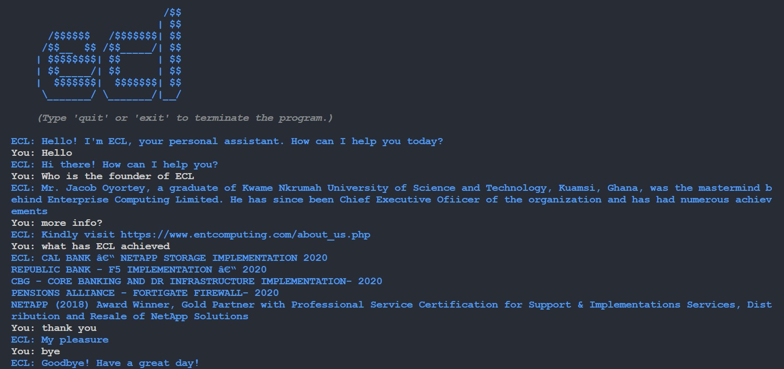

<h1>ECL-Chatbot</h1>
<a name="readme-top"></a>
<br />

<!-- TABLE OF CONTENTS -->
<details>
  <summary>Table of Contents</summary>
  <ol>
    <li>
      <a href="#about-the-project">About The Project</a>
      <ul>
        <li><a href="#built-with">Built With</a></li>
      </ul>
    </li>
    <li>
      <a href="#getting-started">Getting Started</a>
      <ul>
        <li><a href="#prerequisites">Prerequisites</a></li>
        <li><a href="#installation">Installation</a></li>
      </ul>
    </li>
    <li><a href="#usage">Usage</a></li>
    <li><a href="#contributing">Contributing</a></li>
    <li><a href="#contact">Contact</a></li>
    <li><a href="#acknowledgments">Acknowledgments</a></li>
  </ol>
</details>


<!-- ABOUT THE PROJECT -->
## About The Project

This chatbot is personally developed and employs Python's SpaCy, random, colorama, time and system libraries (most of which come built-in). It also employs a Machine Learning model for data processing and prediction. The code is well-commented for easy understanding and includes basic syntaxes with functions to improve code readability and reusability. 
This is limited to the scope of Enterprise Computing Limited but can be edited to fit any domain as required; see <a href="#installation">Installation</a> for more related info


<p align="right">(<a href="#readme-top">back to top</a>)</p>


### Built With

This project was built with the following:

*   Python
  
<p align="right">(<a href="#readme-top">back to top</a>)</p>


<!-- GETTING STARTED -->
## Getting Started

You can fork this and make any changes as you please.

### Prerequisites

* spaCy
  ```sh
  pip install spacy
  ```
* colorama
  ```sh
  pip install colorama
  ```

### Installation

1. Clone the repo
   ```sh
   git clone https://github.com/OTurkson/ECL-Chatbot.git
   ```
2. Install spaCy package
   ```sh
   pip install spacy
   ```
3. Install colorama package (if not already installed)
   ```sh
   pip install colorama
   ```

<p align="right">(<a href="#readme-top">back to top</a>)</p>


<!-- USAGE EXAMPLES -->
## Usage
Sample usage of the chatbot



<p align="right">(<a href="#readme-top">back to top</a>)</p>


<!-- CONTRIBUTING --> 
## Contributing

Any contributions you make are **greatly appreciated**.

If you have a suggestion that would make this better, please fork the repo and create a pull request. You can also simply open an issue with the tag "enhancement".
Don't forget to give the project a star! Thanks again!

1. Fork the Project
2. Create your Feature Branch (`git checkout -b feature/AmazingFeature`)
3. Commit your Changes (`git commit -m 'Add some AmazingFeature'`)
4. Push to the Branch (`git push origin feature/AmazingFeature`)
5. Open a Pull Request

<p align="right">(<a href="#readme-top">back to top</a>)</p>

<!-- CONTACT -->
## Contact

Ekow Owusu-Turkson - [@_bornofthesun](https://twitter.com/_bornofthesun) - eowusuturkson@gmail.com

Project Link: [https://github.com/OTurkson/ECL-Chatbot](https://github.com/OTurkson/ECL-Chatbot)

<p align="right">(<a href="#readme-top">back to top</a>)</p>


<!-- ACKNOWLEDGMENTS -->
## Acknowledgments


* [spaCy](https://spacy.io/usage/spacy-101)
* [GitHub Copilot](https://github.com/features/copilot)

<p align="right">(<a href="#readme-top">back to top</a>)</p>
